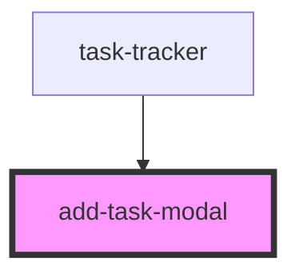

# add-task-modal

<!-- Auto Generated Below -->

## Properties

| Property | Attribute | Description | Type                  | Default     |
| -------- | --------- | ----------- | --------------------- | ----------- |
| `onAdd`  | --        |             | `(task: any) => void` | `undefined` |

## Dependencies

### Used by

 - [task-tracker](../task-tracker)

### Graph

----------------------------------------------

*Built with [StencilJS](https://stenciljs.com/)*
