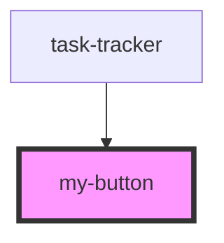

# my-button

<!-- Auto Generated Below -->

## Properties

| Property | Attribute | Description | Type     | Default     |
| -------- | --------- | ----------- | -------- | ----------- |
| `color`  | `color`   |             | `string` | `undefined` |
| `text`   | `text`    |             | `string` | `undefined` |

## Events

| Event     | Description | Type               |
| --------- | ----------- | ------------------ |
| `onClick` |             | `CustomEvent<any>` |

## Dependencies

### Used by

 - [task-tracker](../task-tracker)

### Graph

----------------------------------------------

*Built with [StencilJS](https://stenciljs.com/)*
