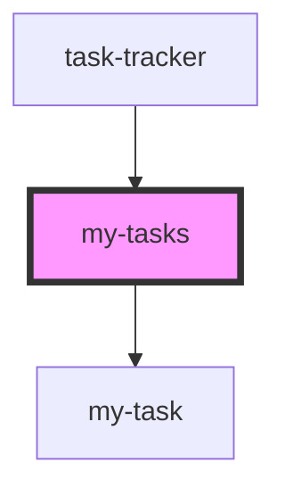

# my-tasks

<!-- Auto Generated Below -->

## Properties

| Property   | Attribute | Description | Type                   | Default     |
| ---------- | --------- | ----------- | ---------------------- | ----------- |
| `onDelete` | --        |             | `(id: number) => void` | `undefined` |
| `onToggle` | --        |             | `(id: number) => void` | `undefined` |
| `tasks`    | --        |             | `Task[]`               | `undefined` |

## Dependencies

### Used by

 - [task-tracker](../task-tracker)

### Depends on

- [my-task](../my-task)

### Graph

----------------------------------------------

*Built with [StencilJS](https://stenciljs.com/)*
